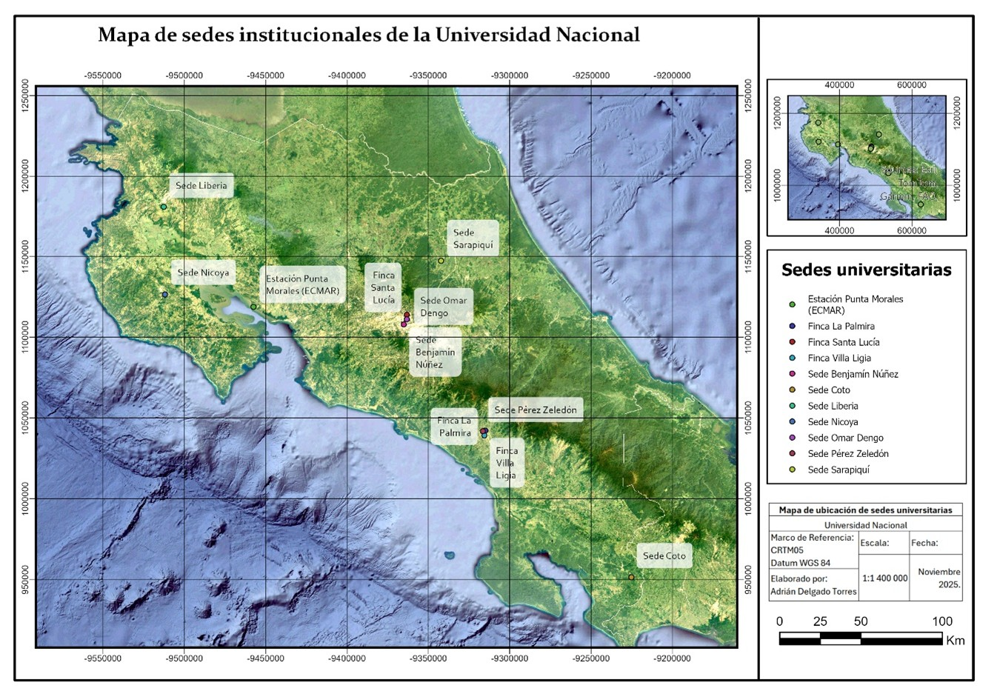
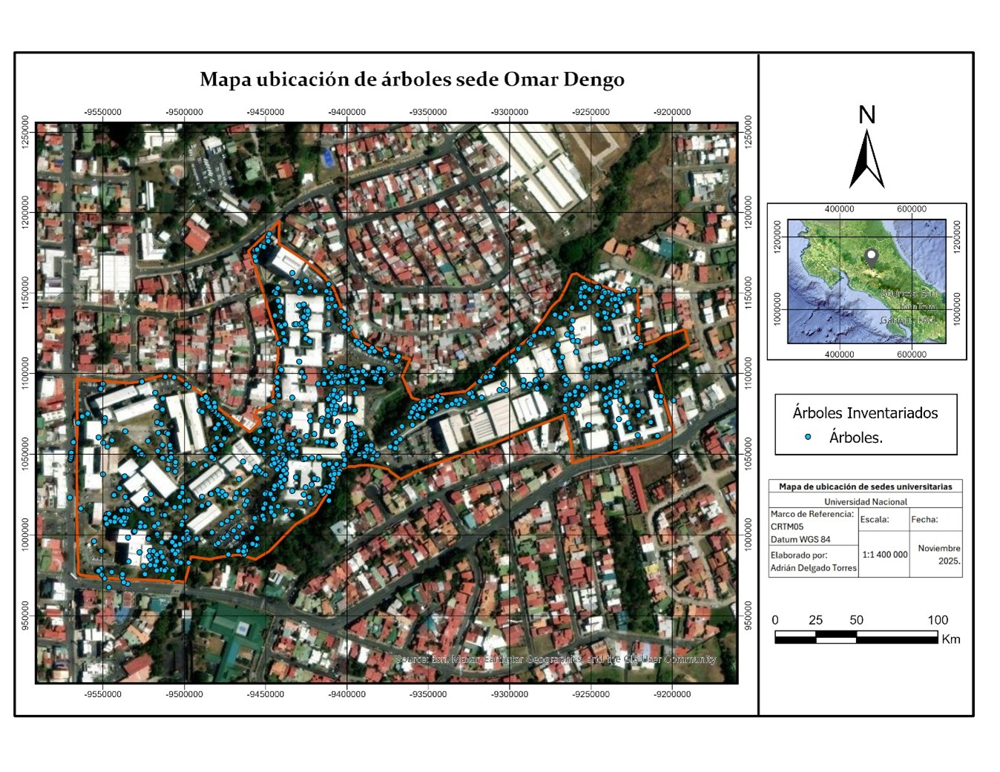

# Diseño e implementación de una base de datos espacial para la gestión del inventario arbóreo y la estimación del carbono almacenado en el campus Omar Dengo, UNA

**Adrián Delgado Torres**  
Programa de Posgrado en Sistemas de Información Geográfica y Teledetección  
Universidad Nacional de Costa Rica — 2025

---

## Descripción general del tema

El ciclo global del carbono constituye uno de los procesos fundamentales que regulan el clima planetario. Los bosques y demás ecosistemas terrestres desempeñan un papel crucial en este ciclo al actuar como sumideros naturales de dióxido de carbono (CO₂), retirando de la atmósfera aproximadamente **2,6 gigatoneladas de carbono por año** (Pan et al., 2011). Los árboles capturan CO₂ a través de la fotosíntesis, lo transforman en biomasa y lo almacenan en raíces, tallos y hojas, proceso que reduce la concentración de gases de efecto invernadero (GEI) y contribuye a mitigar el cambio climático.

En este contexto, la Universidad Nacional (UNA) ha incorporado el manejo de su arbolado urbano en el marco del *Programa País Carbono Neutralidad* (PPCN 2.0), reconociendo que cada árbol dentro de sus campus representa un aporte directo a la reducción de la huella institucional. Sin embargo, la cuantificación precisa del carbono almacenado depende de la calidad de los inventarios y de las metodologías empleadas.

El presente proyecto propone el diseño e implementación de una **base de datos espacial (geodatabase)** para sistematizar el inventario arbóreo del campus Omar Dengo, integrando formularios digitales de captura en campo, modelos alométricos validados y herramientas de visualización y reporte. Esta solución permitirá superar las limitaciones del sistema manual actualmente vigente y fortalecer el aporte de la UNA a la descarbonización nacional.

---

## Introducción

El cambio climático, causado inequívocamente por la actividad humana, exige reducciones rápidas y profundas de las emisiones de GEI y el fortalecimiento de los sumideros terrestres (IPCC, 2023). Antes de la Revolución Industrial, los niveles de CO₂ atmosférico rondaban las 280 ppm; en 2023 superaron las **420 ppm**, el valor más alto en al menos 800.000 años según los registros paleoclimáticos (NOAA, 2023).

Costa Rica ha definido una ruta clara hacia la descarbonización mediante el [Plan Nacional de Descarbonización 2018–2050](https://cambioclimatico.go.cr) y el Programa País Carbono Neutralidad (PPCN 2.0). En este marco, la gestión del arbolado universitario se convierte en un eje estratégico de sostenibilidad institucional.

La neutralidad de carbono se alcanza cuando el balance entre emisiones y remociones es igual a cero, según la ecuación:

**E − R − C = 0**

donde *E* son las emisiones totales, *R* son las reducciones internas y *C* son las compensaciones externas de GEI.

  
*Mapa 1. Sedes institucionales de la Universidad Nacional en Costa Rica. Fuente: elaboración propia.*

---

## El problema

La cuantificación del carbono almacenado en el arbolado urbano de la UNA se realiza actualmente de forma **manual**, mediante hojas de cálculo y registros en papel. Esta metodología introduce múltiples limitaciones:

- **Vulnerabilidad de la información**: los formularios en papel pueden perderse o dañarse bajo condiciones climáticas adversas.
- **Errores de digitación**: los errores de transcripción y de arrastre de fórmulas en Excel comprometen la precisión de los cálculos.
- **Alto costo operativo**: el tiempo y los recursos humanos requeridos para procesar y verificar los datos son elevados.
- **Escasa capacidad de análisis espacial**: el sistema actual no permite integrar análisis geoespaciales ni generar reportes automatizados.
- **Falta de trazabilidad**: la información permanece fragmentada y carece de series históricas comparables.

Ante esta situación, la investigación busca responder la siguiente pregunta:

> *¿Cómo puede la UNA superar las limitaciones de un inventario manual y fragmentado, garantizando la integridad de los datos, reduciendo los errores de campo y optimizando la generación de análisis y reportes mediante la implementación de una geodatabase y formularios digitales integrados?*

---

## Justificación

El arbolado urbano de los campus de la UNA cumple una función ecosistémica relevante: además de almacenar carbono, provee servicios como regulación térmica, mejora de la calidad del aire y bienestar social (Nowak et al., 2013). Para que estos aportes sean reconocidos en el PPCN, los datos deben ser verificables, comparables y reproducibles.

La implementación de una *geodatabase corporativa* permitirá:

1. Consolidar toda la información del inventario bajo una estructura relacional, georreferenciada y actualizable en tiempo real.
2. Automatizar los cálculos de biomasa y carbono mediante modelos alométricos validados (Segura et al., 2006; Chave et al., 2014).
3. Facilitar auditorías externas con registros trazables y metadatos completos.
4. Generar dashboards y mapas temáticos para la toma de decisiones.

Esta solución no solo responde a una necesidad operativa, sino que reafirma el compromiso institucional de la UNA con la carbono neutralidad y constituye una experiencia replicable para otras instituciones públicas del país.

  
*Mapa 2. Distribución de los árboles del inventario de remociones del Campus Omar Dengo, UNA. Fuente: elaboración propia.*

---

## Objetivos

### Objetivo general

Sistematizar la información del inventario arbóreo del campus Omar Dengo de la Universidad Nacional (UNA), mediante el diseño e implementación de una base de datos espacial, para optimizar la gestión, el análisis y la mejora continua del Programa de Carbono Neutralidad Institucional.

### Objetivos específicos

1. Estructurar los datos mediante SQL para organizar y gestionar de manera integral el inventario arbóreo, permitiendo la captura y actualización de información del inventario de remociones de carbono.
2. Construir instrumentos digitales utilizando tecnología licenciada (ArcGIS Survey123 / Field Maps) para la recolección estandarizada de datos dendrométricos georreferenciados, facilitando la actualización anual y la verificación en sitio frente a registros históricos.

---

## Marco teórico

### Carbono en ecosistemas forestales y urbanos

Los bosques tropicales, como los de Costa Rica, presentan tasas de fijación de carbono de entre **5 y 10 toneladas por hectárea al año** (IPCC, 2019), convirtiéndolos en reservorios estratégicos a escala global. La síntesis global de inventarios forestales cuantifica un sumidero neto de 2,4 ± 0,4 Pg C·a⁻¹ en los bosques del mundo (Pan et al., 2011). Costa Rica mantiene una cobertura forestal aproximada al 60 % del territorio para 2022, resultado de décadas de políticas de conservación y restauración (FAO, 2020).

El arbolado urbano complementa a los bosques al remover CO₂ y almacenar carbono en biomasa, ofreciendo además cobeneficios como mitigación de islas de calor, mejora de la calidad del aire y confort térmico (Nowak et al., 2013; Escobedo et al., 2011).

### Modelos alométricos para estimar biomasa y carbono

Los modelos alométricos vinculan medidas dendrométricas —como el **diámetro a la altura del pecho (DAP)**, la altura total (H) y la densidad de la madera (ρ)— con la biomasa aérea (AGB). La actualización pan-tropical de Chave et al. (2014) propone:

**AGB = 0.0673 · (ρ · D² · H)^0.976**

con D en cm, H en m y ρ en g·cm⁻³. La conversión de biomasa a carbono se realiza aplicando la fracción de carbono recomendada por el IPCC (Tier 1): **0,47 t C por tonelada de biomasa seca** (IPCC, 2006).

Para Costa Rica existen modelos locales desarrollados por Segura & Kanninen (2005) y Fonseca et al. (2009) que mejoran la precisión frente a ecuaciones genéricas, constituyendo la base de las estimaciones oficiales del inventario nacional.

### Geodatabase para inventarios históricos

Una geodatabase es el modelo de almacenamiento de datos espaciales que organiza información geográfica (puntos, líneas, polígonos) junto con atributos alfanuméricos, reglas, relaciones y metadatos. A diferencia de los archivos tradicionales como *shapefiles* o tablas planas, proporciona un marco estructurado que soporta dominios de atributos, subtipos, relaciones jerárquicas, topología y reglas de validación (Esri, 2020).

En el contexto del inventario arbóreo, la geodatabase permite registrar **series históricas por individuo**, almacenando mediciones periódicas de DAP, altura, biomasa y carbono, estructuradas en tablas relacionadas (*Arboles–Mediciones*, relación 1:N). Esto habilita análisis interanuales sin necesidad de rehacer inventarios completos.

La captura de datos en campo se potencia con aplicaciones móviles como [ArcGIS Survey123](https://survey123.arcgis.com) y [ArcGIS Field Maps](https://www.esri.com/en-us/arcgis/products/arcgis-field-maps/overview), integradas con receptores GNSS de alta precisión. Estas herramientas permiten recolectar datos normalizados, aplicar validaciones automáticas y adjuntar fotografías, asegurando calidad desde la fuente.

---

## Descripción de los datos y sus principales variables

El inventario arbóreo del campus Omar Dengo constituye el conjunto de datos central del proyecto. Las principales variables recopiladas por individuo son:

| Variable | Descripción | Unidad |
|---|---|---|
| Código de árbol | Identificador único | Alfanumérico |
| Especie | Nombre científico y común | Texto |
| DAP | Diámetro a la altura del pecho | cm |
| Altura total (H) | Altura desde la base hasta el ápice | m |
| Densidad de la madera (ρ) | Peso seco por volumen | g/cm³ |
| Condición sanitaria | Estado fitosanitario general | Categoría |
| Biomasa aérea (AGB) | Estimada con modelo alométrico | t |
| Carbono almacenado | AGB × 0,47 | t C |
| CO₂ equivalente | Carbono × 3,6667 | t CO₂e |
| Ubicación geográfica | Coordenadas GNSS | Latitud / Longitud |
| Fecha de medición | Fecha del levantamiento | dd/mm/aaaa |

Adicionalmente, el sistema incluye variables de contexto como el campus, la zona dentro del campus, el técnico responsable del levantamiento y metadatos de calidad posicional (precisión horizontal, PDOP, tipo de fix GNSS).

---

## Problemas a resolver y preguntas de investigación

El proyecto busca responder las siguientes preguntas con los datos geoespaciales del inventario:

1. **¿Cuánto carbono almacena actualmente el arbolado del campus Omar Dengo** y cuál es su distribución espacial por zona?
2. **¿Cómo ha evolucionado el stock de carbono** entre los diferentes años de inventario disponibles?
3. **¿Cuáles especies arbóreas contribuyen más** al almacenamiento de carbono en el campus?
4. **¿Existen vacíos espaciales** —zonas del campus con baja cobertura arbórea— que representen oportunidades de restauración?
5. **¿Qué tan confiables son los datos actuales** en términos de calidad posicional y consistencia de atributos, comparados con los estándares ISO 19157?
6. **¿Es posible automatizar completamente** el cálculo de biomasa y carbono dentro de la geodatabase, eliminando la dependencia de hojas de cálculo externas?

---

## Referencias bibliográficas

Chave, J., et al. (2014). Improved allometric models to estimate the aboveground biomass of tropical trees. *Global Change Biology, 20*(10), 3177–3190.

Escobedo, F. J., Kroeger, T., & Wagner, J. E. (2011). Urban forests and pollution mitigation: Analyzing ecosystem services and disservices. *Environmental Pollution, 159*(8–9), 2078–2087.

Esri. (2020). *Attribute domains — ArcGIS Pro*. https://pro.arcgis.com/en/pro-app/latest/help/data/geodatabases/overview/attribute-domains.htm

FAO. (2016). *Guidelines on Urban and Peri-urban Forestry*. FAO Forestry Paper 178. https://openknowledge.fao.org

FAO. (2020). *Global Forest Resources Assessment 2020*. Food and Agriculture Organization of the United Nations.

Fonseca, W., Alice, F., & Rey-Benayas, J. M. (2009). Modelos para estimar la biomasa de especies nativas en plantaciones y bosques secundarios en la zona Caribe de Costa Rica. *Bosque, 30*(1), 36–47. https://doi.org/10.4067/S0717-92002009000100006

INTECO. (2016). *INTE B5:2016 Carbono Neutralidad. Requisitos para demostrar la carbono neutralidad*. Instituto de Normas Técnicas de Costa Rica.

IPCC. (2006). *2006 IPCC Guidelines for National Greenhouse Gas Inventories. Volume 4: AFOLU*. https://www.ipcc-nggip.iges.or.jp/public/2006gl/vol4.html

IPCC. (2019). *Climate Change and Land: An IPCC Special Report*. https://www.ipcc.ch/srccl/

IPCC. (2023). *AR6 Synthesis Report: Climate Change 2023*. https://doi.org/10.59327/IPCC/AR6-9789291691647.001

MINAE. (2017). *Reglamento del Programa País Carbono Neutralidad 2.0*. Decreto Ejecutivo N.° 41122-MINAE. https://faolex.fao.org/docs/pdf/cos178009anx.pdf

MINAE. (2019). *Plan Nacional de Descarbonización 2018–2050*. https://cambioclimatico.go.cr

NOAA. (2023). *Trends in Atmospheric Carbon Dioxide*. https://gml.noaa.gov/ccgg/trends/

Nowak, D. J., Greenfield, E. J., Hoehn, R. E., & Lapoint, E. (2013). Carbon storage and sequestration by trees in urban and community areas of the United States. *Environmental Pollution, 178*, 229–236.

Pan, Y., et al. (2011). A large and persistent carbon sink in the world's forests. *Science, 333*(6045), 988–993.

Segura, M., & Kanninen, M. (2005). Allometric models for tree volume and total aboveground biomass in a tropical humid forest in Costa Rica. *Biotropica, 37*(1), 2–8. https://doi.org/10.1111/j.1744-7429.2005.02027.x

Segura, M., Kanninen, M., & Suárez, D. (2006). Allometric models for estimating aboveground biomass of shade trees and coffee bushes grown together. *Agroforestry Systems, 68*(2), 143–150. https://doi.org/10.1007/s10457-006-9005-x

Tomlinson, R. (2011). *Thinking About GIS: GIS Planning for Managers* (5th ed.). Esri Press.

UNFCCC. (2020). *Costa Rica — First NDC (Updated submission)*. United Nations Framework Convention on Climate Change.

---

*Sitio desarrollado como parte del Anteproyecto de Graduación, Maestría en SIG y Teledetección, Universidad Nacional de Costa Rica.*
